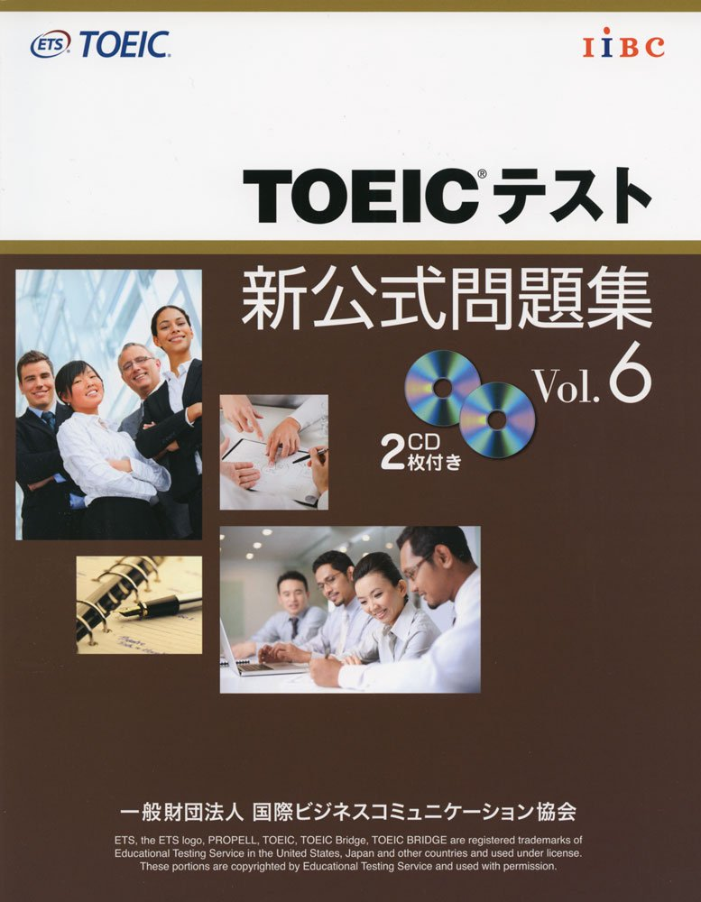

### ほにゃららセッションリレー
## 1ヶ月でTOEICスコアアップしちゃおうのお話

うめ（@beConjuror）

---

### Who?
- うめ(@beConjuror)
- Work：ITSM/DevOpsとか@SIer9年目
- Hot：トキワの森プロジェクト企画

---
### みなさん、（英語の）勉強は好きですかー？

---

### はい。私も嫌いです。。。

---

### でも、英語はみにつけたいですよね？

---

### ということで、
#### 「インフラエンジニアのための、さくっとしっかりTOEICのスコアをアップできる方法」

---

### Why?
- 3ヶ月のスコアアッププログラムに参加
- チーム戦でスコア上げるのが目的
- 500から720までアップした

---

### TOEICについて
- 国際的な英語の認定資格|
- 990点満点|
- リスニングとリーディングがあります|

---
### さて、どうやって勉強するのがいいでしょうか？

---

---

### 他には・・・

---

### 問題集だけです！

---

### 同じ問題を5周くらい

---

### 逆にやらない方がいい勉強って？

---

### おすすめしない勉強方法
- テキストいっぱい買う
- ラジオみる
- 海外の映画をみる

---

### Why English?

---

### たいくつな資格試験は集中してさくっと取得してしまいましょう！

---

### おわり
